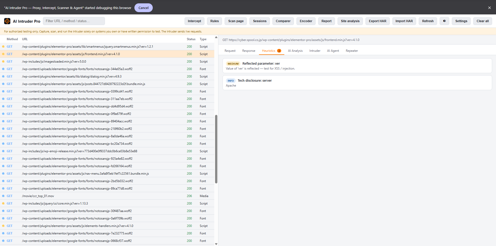
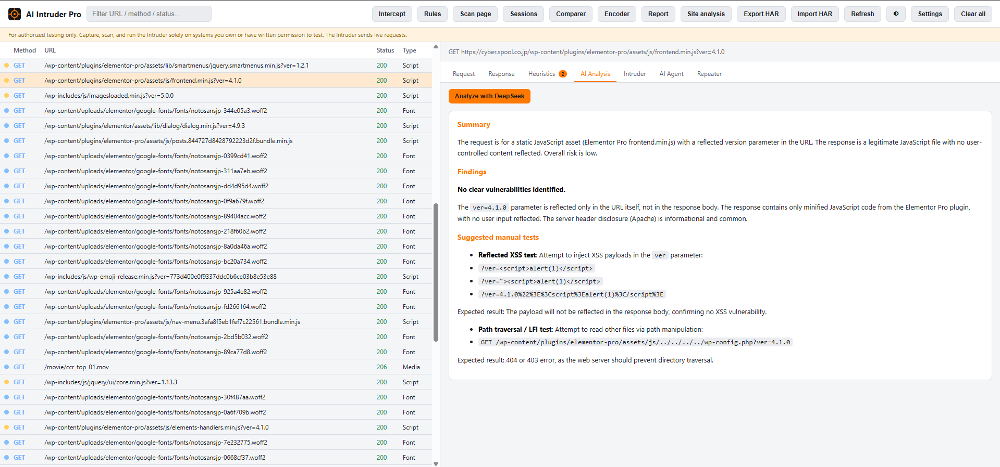
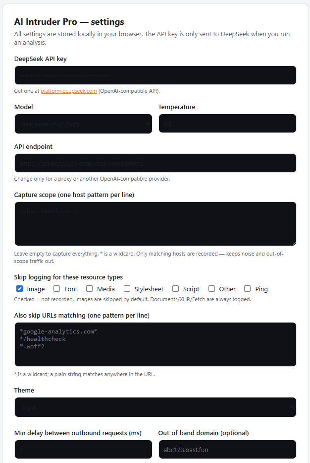

# AI Intruder Pro

**An AI-augmented Burp Suite that lives *inside* your browser.** No proxy, no CA certificate — turn it
on, browse the target normally, and it passively captures every request/response, lets you intercept and
rewrite traffic, fuzz with an AI Intruder, scan the live DOM and JS, run multi-session IDOR tests, and
turn loose a constrained AI testing agent. All analysis is powered by the **DeepSeek API**.

Chrome / Edge extension · Manifest V3 · **v3.0.6**

> ⚠️ **Authorized testing only.** Use this on systems you own or have explicit written permission to
> test. Interception, Repeater, Intruder, and the Agent send **live requests** using your active
> session. Per-request scope enforcement is on by default to help keep traffic in bounds — but it is a
> safeguard, not a substitute for authorization.

---

## Screenshots

**HTTP history + passive heuristics** — every request captured as you browse, with per-request findings
(here: a reflected `ver` parameter flagged for XSS/injection testing).

**AI Analysis** — one click sends the selected transaction to DeepSeek for a structured review: summary,
findings, and concrete suggested manual tests.

**Settings** — API key, scope, resource-type/URL exclude filters, theme, outbound rate limit, and OOB
domain. Everything is stored locally; the API key is only sent to DeepSeek when you run an analysis.

---

## Why it's different

Proxy tools (Burp, Caido, ZAP) own the network layer. This tool's edge is that it runs **in the page** —
it can see the live DOM, executed JavaScript, event listeners, `postMessage` handlers, storage, and
client-side routing that a network proxy never cleanly sees. It fuses captured HTTP traffic with that
client-side context and points an AI at the combination. That's the capability a proxy can't match.

It attaches via the **Chrome DevTools Protocol** (`chrome.debugger`), so there's nothing to configure on
the network — just toggle capture on.

---

## Features

### Traffic capture
- Passive capture of full HTTP **requests and responses** (headers + bodies) via CDP — no proxy/cert.
- Request-body retrieval (`getRequestPostData` fallback) and response-body retrieval; binary/media
  skipped, large bodies truncated (~300 KB).
- **WebSocket frame** capture (sent/received).
- **IndexedDB** storage backbone (ring buffer, up to 5,000 entries) for speed and scale.
- Auto attach/reattach to tabs and a service-worker **keepalive** alarm.

### Scope & noise control
- **Scope filtering** by host pattern with `*` wildcards (`example.com`, `*.example.com`) — only
  in-scope hosts are recorded.
- **Resource-type exclude filter** — Images excluded by default; toggle Fonts/Media/Stylesheets/
  Scripts/Other/Ping. Catches images by CDP type *and* file extension.
- **URL glob skip** patterns (e.g. `*analytics*`, `*/healthcheck`, `*.woff2`). Documents/XHR/Fetch are
  always kept.

### Interception & rewriting (CDP Fetch domain)
- **Dedicated intercept window** (Burp-style): a queue on the left, the focused request shown large on
  the right with a full-height editable raw request, big **Forward → / Drop ✕** actions, **Forward all**,
  a live "N held" count and ON/OFF state pill.
- **Keyboard shortcuts**: `F` forward · `D` drop · `A` forward all · `J`/`K` or arrows to move between
  held requests · `Ctrl+Enter` to forward your edited version.
- **Smart hold defaults**: only holds **Document / XHR / Fetch** by default and auto-forwards CORS
  **preflight OPTIONS** and static assets — so you stop once, on the request that actually carries your
  parameter. Toggles let you "hold all request types" or "include OPTIONS" when you need them.
- **Edited requests are replayed faithfully**: when you change a request, the extension sends *exactly*
  that request and fulfills the response to the page — it is not re-issued through Chrome's URL override,
  so there's no double-pause and your edit always applies. HTTP/2 pseudo-headers (`:path`, `:authority`,
  …) and stale `content-length` are stripped automatically. Edits are reflected in the captured history.
- **Match-and-replace rules**: rewrite request/response URL, headers, or body (plain string or regex),
  each individually enable/disable, full CRUD. Rules still apply to auto-forwarded requests. Fetch
  interception only activates while capturing.

### Passive scanner (local, no API)
- Missing security headers (CSP, HSTS, X-Frame-Options, nosniff, Referrer-Policy).
- Weak cookie flags (HttpOnly / Secure / SameSite).
- Reflected parameters, tech-stack disclosure, SQL error signatures, 5xx leakage.
- Secrets in responses (private keys, AWS keys, JWTs, secret keywords).
- **CORS** misconfig (wildcard + credentials, reflected-origin + credentials).
- Mixed content, **CSP weaknesses** (`unsafe-inline`/`unsafe-eval`, wildcard `script-src`).
- **GraphQL introspection**, **open-redirect** candidates, **JWT** detection with `alg:none` flagging,
  and state-changing-via-GET (verb tampering) hints.
- **Severity dots** in the history list summarizing each request's findings.

### Client-side / JS scanner (the in-browser edge)
- Scans the active page's DOM for **XSS sinks** (`innerHTML`, `outerHTML`, `document.write`, `eval`,
  `new Function`, `insertAdjacentHTML`, `location` assignment, `dangerouslySetInnerHTML`) and
  `postMessage` listeners without origin checks.
- Mines inline + external JS for **secrets** (AWS, Google, GitHub, Slack, Stripe, private keys, JWTs,
  generic) and discovers **hidden API endpoints**.
- Reports `localStorage`/`sessionStorage` keys, non-HttpOnly cookies, and forms — with optional AI review.

### AI Intruder (fuzzer)
- `§ §` insertion points (mark from selection); battering-ram mode.
- Built-in payload sets: **XSS, SQLi, path traversal/LFI, command injection, SSTI, open redirect/SSRF,
  generic fuzz**.
- **DeepSeek-generated**, context-aware payloads for the exact parameter, plus `{{OOB}}` templating for
  blind tests.
- Throttled concurrent firing with **delay/concurrency controls and a Stop button**; runs a baseline
  first, then auto-flags anomalies: status Δ, length Δ, reflected payload, error signatures, grep match,
  time spike. Click any result to view its response.
- **One-click AI triage** of the whole result set.

### Repeater & multi-session IDOR
- Edit and resend any raw request.
- Save **identities** (Cookie / Authorization), apply them to a request, and run an **IDOR compare**:
  send as two identities, get a same-status/same-length verdict, and a response diff.

### AI analysis (DeepSeek)
- **Per-request** vulnerability review (summary, findings with severity/evidence/remediation, suggested
  manual tests).
- **Site-wide analysis** with cross-request **correlation** — IDOR candidates, auth inconsistencies,
  sensitive-no-auth endpoints, and a findings tally — shown instantly (local) then enriched by AI.
- **AI testing Agent**: a constrained plan → execute → iterate loop, scope-enforced, that asks for
  confirmation before any state-changing verb and writes a conclusion.
- **AI-written findings report**, downloadable as Markdown.
- Configurable model, temperature, and OpenAI-compatible endpoint.

### Tools & data
- **Response comparer** with word-level diff between any two captured responses.
- **Encoder/decoder**: URL, URL-all, base64, hex, HTML, unicode-escape, and JWT decode.
- **HAR import/export** — analyze traffic from DevTools/Burp, or export your captures.

### Safety & ops
- Per-request **scope enforcement** that blocks Repeater/Intruder/Agent from leaving scope (toggleable).
- Outbound **rate limiting** (min delay between requests) and an **audit log** of sent requests.
- **Light / dark / auto** theme with a header toggle, and a responsible-use banner.

---

## Install (load unpacked)

1. Download/clone this repo somewhere permanent (the unpacked path must stay put).
2. Open `chrome://extensions` (or `edge://extensions`) → enable **Developer mode**.
3. **Load unpacked** → select the project folder.
4. Open **Settings** and:
   - add your **DeepSeek API key** (OpenAI-compatible endpoint; model/temperature configurable),
   - set your **scope** (host patterns),
   - review the **exclude filter** (images skipped by default) and **outbound rate limit**,
   - pick a **theme**.

## Quick tour

- **Toolbar popup**: toggle **Capture** and **Manual intercept**. The badge counts captured requests
  (orange = capturing, red = intercepting, grey = off). Turning intercept on auto-opens the intercept window.
- **Analyzer** (header buttons): Intercept · Rules · Scan page · Sessions · Comparer · Encoder · Report ·
  Site analysis · Export/Import HAR · theme · Settings · Clear.
- **Per request** tabs: **Request · Response · Heuristics · AI Analysis · Intruder · AI Agent · Repeater**.

A typical flow: turn on Capture → browse the target → open the Analyzer → pick an interesting request →
read **Heuristics** and **AI Analysis** → send it to the **Intruder** or **Repeater** → for access-control
testing, save two **identities** and run the **IDOR compare** → generate a **Report**.

---

## Files

| File | Purpose |
|------|---------|
| `manifest.json` | MV3 manifest (debugger, scripting, storage, alarms) |
| `db.js` | IndexedDB backbone (entries + audit) |
| `background.js` | Capture, WebSocket, Fetch interception, rules, page-scan, messaging |
| `analyzer.js` | Heuristics, correlation, JS mining, AI prompts, agent, report, scope/rate/audit sender |
| `tools.js` | Encoders/decoders, JWT decode, word-level diff |
| `payloads.js` | Built-in Intruder payloads |
| `theme.js` | Light/dark/auto theme |
| `popup.html` / `popup.js` | Capture + intercept toggles |
| `viewer.html` / `viewer.js` | Full analyzer UI and all tools |
| `intercept.html` / `intercept.js` | Dedicated interception window (queue + focused editor + shortcuts) |
| `options.html` / `options.js` | API, scope, exclude filter, rate limit, OOB, theme |

---

## Notes & limits

- **Browser-runtime features need live testing.** The capture/interception path (CDP Fetch), the
  content-script page scan (`chrome.scripting`), and the agent loop are implemented against the
  documented APIs and unit-tested where the logic is pure, but cannot be exercised outside a browser.
  Verify behavior on an authorized target before relying on them.
- **Manual intercept holds the page.** While intercept is ON (and capturing), matching requests pause
  until you forward/drop them — the page itself hangs until you act, which is inherent to interception.
  Toggle intercept off to release. The keepalive alarm mitigates service-worker suspension, but the MV3
  model has limits.
- **Edited-request replay caveats.** Because the extension sends edited requests itself and fulfills the
  response: cookies come from the browser's jar (editing the `Cookie` header specifically won't apply
  through this path), and `Set-Cookie` from a followed redirect isn't propagated back. For URL/body
  parameter tampering this doesn't matter.
- Only one debugger client per tab — **close DevTools** on a tab you want to capture/intercept.
- Heuristics, Intruder flags, and IDOR verdicts are **leads, not proof** — confirm manually.
- Blind-vuln (OOB) detection sets up the payloads; you confirm hits on your own collaborator/OOB service.

## License

Provided as-is for authorized security testing and education. You are responsible for how you use it.
